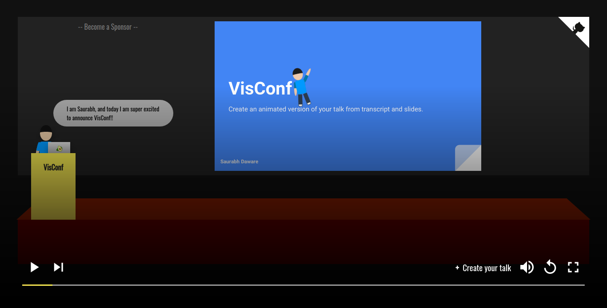

# VisConf


A web based talk visualiser for the conference/meetup talks. 

VisConf lets you generate an animated version of your talk from your slides and transcript.


***Example:*** https://visconf.netlify.com/saurabhdaware/visconf-intro




---
# Table of Content
- [How to Create your Visual Talk](#how-to-create-your-visual-talk)
- [Transcript Markdown Guide](#transcript-markdown)
- [Locally Test Transcript and Slides](#locally-test-transcript-and-slides)

---

# How to Create your Visual Talk
- Create [Transcript.md](https://github.com/saurabhdaware/visconf-example/blob/master/Transcript.md) file and write your transcript (You can use [Transcript Markdown](#transcript-markdown)) 
- Convert your slides to **PDF** file
- Upload `slides.pdf` and `transcript.md` to CDN (even GitHub Repository works)
- Fork this repository and take clone of your fork
- Edit [src/talks.json](src/talks.json) file and add your configurations in following format
```json
{
    "data": {
        ":github-username": {
            ":slug-of-talk-title":{
                "title": "My Cool Talk",
                "eventName": "JSConf",
                "slidePdfLink": "https://raw.githubusercontent.com/saurabhdaware/visconf-example/master/slides.pdf", 
                "transcriptLink": "https://raw.githubusercontent.com/saurabhdaware/visconf-example/master/Transcript.md",
                "character": {
                    "skinColor": "#E0AB8B",
                    "tshirtColor": "#09f",
                    "hairColor": "#111",
                    "hairStyle": "short"
                }
            }
        }
    }
}
```
- Send Pull Request to the `master` branch of main repository
- Done!! View your talk at `https://visconf.netlify.com/:github-username/:slug-of-talk-title` 🎉

(You can checkout https://github.com/saurabhdaware/visconf-example for example)

# Transcript Markdown
In transcript you can use characters like `|`, `||` and `$wait5s`.

- Single dash (`|`) will change the text in bubble.
- Double dash (`||`) changes your slide number 
- `$wait2s`, `$wait5s`, and `$wait10s` can be used to make a pause while talking for 2sec, 5sec, and 10sec respectively.

Example Transcript:
```md
Hey There!
| I am Saurabh, and today I am super excited to announce VisConf!!

|| A lot of times in meetups, I see talks on some amazing topics
| Sadly small meetups do not have resources to record and publish these talks
| However the world needs to see them $wait2s

|| So randomly I had the idea of creating an animated version of these talks
| VisConf lets you generate an animated version of talk from transcript and slides
| All you have to do is upload transcript and slides.pdf and send Pull Request to main repository

```

# Locally Test Transcript and Slides

- Fork this repository
- git clone your fork
- run `npm install`
- Copy paste your `slides.pdf` and `transcript.md` to [public/example/](public/example/)
- run `npm run dev`
- View your changes in https://localhost:5000/example-username/test


# Contributing
- Fork this repository
- git clone your fork
- run `npm install` to install dependencies
- `npm run dev` to run local server
- Visit https://localhost:5000/example-username/test


Hope this tool will help! Please share :D Thank You 🌻