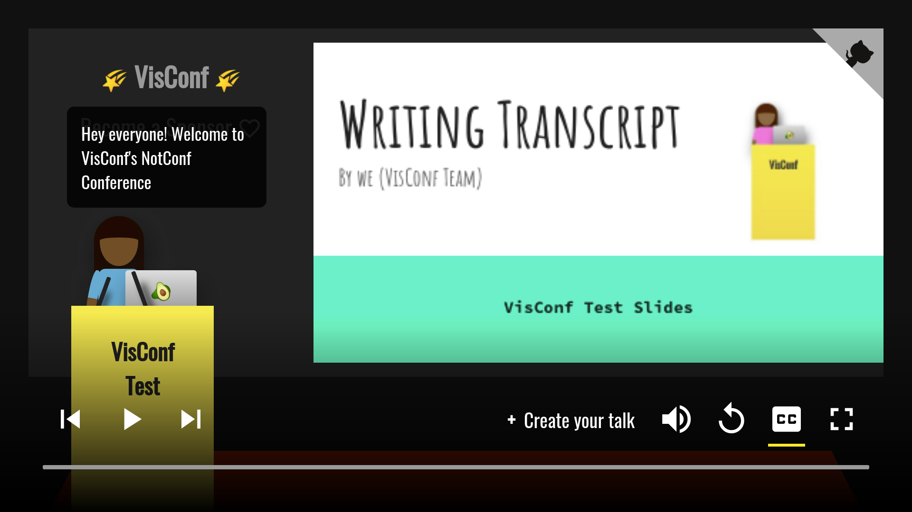

# VisConf


A web based talk visualiser for the conference/meetup talks. 

VisConf lets you generate an animated version of your talk from your slides and transcript.


***Example:*** https://visconf.netlify.com/saurabhdaware/visconf-intro




---
# Table of Content
- [How to Create your Visual Talk](#how-to-create-your-visual-talk)
- [Transcript Markdown Guide](#transcript-markdown)

---

# How to Create your Visual Talk
- Convert your slides to **PDF** file and upload to CDN or GitHub repository.
- Write and test your transcript on [visconf.netlify.com/editor](https://visconf.netlify.com/editor) and upload the transcript file to CDN or GitHub repository.
- Visit https://visconf.netlify.com/create and fill the form 
(You can checkout https://github.com/saurabhdaware/visconf-example for example of transcript and slides)

# Transcript Markdown
In transcript you can use characters like `|`, `||` and `$wait5s`.

- Single dash (`|`) will switch the text in bubble.
- Double dash (`||`) changes to next slide. 
- `$wait2s`, `$wait5s`, and `$wait10s` can be used to make a pause while talking for 2sec, 5sec, and 10sec respectively.

Example Transcript:
```md
Hey There!
| I am Saurabh, and today I am super excited to announce VisConf!!

|| A lot of times in meetups, I see talks on some amazing topics
| Sadly small meetups do not have resources to record and publish these talks
| However the world needs to see them $wait2s

|| So randomly I had the idea of creating an animated version of these talks
| VisConf lets you generate an animated version of talk from transcript and slides
| All you have to do is upload transcript and slides.pdf and send Pull Request to main repository

```

# Contributing
Checkout [CONTRIBUTING.md](CONTRIBUTING.md) for guidelines on contributing and local setup.


---

[](https://www.buymeacoffee.com/ctd6809)

Built with Vanilla JavaScript, WebPack, Netlify, FaunaDB <3

Thank You 🌻